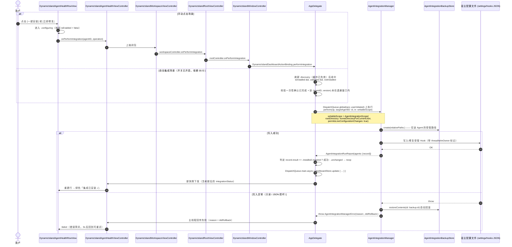

# ThreadHelm Agent 手动一键集成 + 受控自动集成 实施计划 (RFC & Implementation Plan)

- **Date**: 2026-08-15
- **Status**: Implemented（两期均已合入，CI 绿）。计划正文保留为立项时的原貌，
  实际落地与偏差见 §10。
- **Author**: Antigravity
- **Target Subsystem**: `macos/ThreadHelm/Sources/ThreadHelm/`
  - `AgentIntegrationManager.swift`（逻辑与 CLI）
  - `DynamicIslandAgentHealthView.swift`（行视图与详情控制器）
  - `DynamicIslandView.swift`（`DynamicIslandButton`、`DynamicIslandWorkspaceViewController`）
  - `AppDelegate.swift`（调度与 dashboard 刷新）
  - `AgentAdapter.swift` 及各 Adapter（状态与兼容性真值）

---

## 0. 术语对齐 (Ground Truth Types)

本计划中所有类型名以仓库现状为准，实施时不得臆造：

| 概念 | 实际类型 / 定义位置 | 要点 |
| :--- | :--- | :--- |
| 集成管理器 | `struct AgentIntegrationManager` — `AgentIntegrationManager.swift:48` | 仅 3 个入口：`status(in:)`、`perform(_:in:)`、`restoreBackup(id:in:)`。**没有** `install()`/`repair()`/`disable()` 独立方法。 |
| 作用域 | `struct AgentIntegrationScope` — `AgentAdapter.swift:143` | **不是枚举**，字段为 `rootDirectory: URL` + `permitsLiveConfigurationChanges: Bool`；`.isolated(at:)` 为只读隔离工厂。所谓 "live scope" 即 `permitsLiveConfigurationChanges == true`。 |
| 操作 | `enum AgentIntegrationOperation` — `AgentIntegrationManager.swift:12` | `status / install / repair / uninstall / restore`。**不存在 `disable`。** |
| 单次运行报告 | `struct AgentIntegrationRunReport` — `AgentIntegrationManager.swift:27` | 字段 `operation / backupID / restoredBackupID / rolledBack / agents: [AgentIntegrationRunRecord]`。 |
| 单 Agent 记录 | `struct AgentIntegrationRunRecord` — `AgentIntegrationManager.swift:20` | 字段 `agentID / statusBefore / result: AgentIntegrationOperationResult? / statusAfter`，`result` 为**可选**。 |
| 操作结果 | `enum AgentIntegrationOperationResult` — `AgentAdapter.swift:135` | `notManaged / unchanged / installed / repaired / uninstalled`。 |
| 管理器错误 | `struct AgentIntegrationManagerError: LocalizedError` — `AgentIntegrationManager.swift:35` | **不是枚举**，字段为 `operation / agentID / reason / didRollback`。 |
| 集成状态 | `enum AgentIntegrationStatus` — `AgentAdapter.swift:106` | **7 个 case**：`notManaged / notInstalled / installed / disabled / needsRepair / unsupportedVersion / checkFailed`。注意 `AgentRuntimeStatus.integrationStatus` 是 `Optional`，UI 必须额外处理 `nil`（共 8 种渲染分支，但**枚举本身只有 7 个 case，不得扩展**）。 |
| 版本兼容性 | `enum AgentCompatibility` — `AgentAdapter.swift:11` | **3 个 case**：`validated / unvalidated / unknown`。`supported`/`unsupportedVersion` 只是旧 mock 的 static 别名，新代码禁止使用。 |
| 发现结果 | `AgentRuntimeStatus.discovery: AgentDiscovery` — `AgentAdapter.swift:221` / `:28` | `compatibility` 挂在 `AgentDiscovery` 上。 |
| 备份仓库 | `struct AgentIntegrationBackupStore` — `AgentIntegrationManager.swift:346` | `create(relativePaths:)` / `restore(id:)` / `restoreContents(id:)`。备份根目录不是常量，是计算属性 `backupRootURL`（`:652`），live 下解析为 `~/Library/Application Support/ThreadHelm/Integration Backups/`。每次 `create` 生成独立 UUID 子目录。 |
| 原子写入器 | `enum AgentIntegrationAtomicFileWriter` — `AgentIntegrationManager.swift:205-254` | **全部 4 个受管 adapter 的写入都走它**（`ClaudeHookSupport.swift:725`、`CursorAgentAdapter.swift:523`、`ZCodeAgentAdapter.swift:226/275/282/465`、`OMPAgentAdapter.swift:326`）。它是 temp 文件 + `rename(2)`，只要求**父目录**可写，写完把权限重设为 0600。 |
| 发现缓存 | `LocalAgentDiscoveryCache` — `AgentAdapter.swift:907-929`；`CursorDiscoveryCache` — `CursorAgentAdapter.swift:618` 起 | **进程级永久缓存，无 TTL、无失效**（`if let cached { return cached }`，`AgentAdapter.swift:921`）。覆盖 Codex / Claude Code / Cursor；ZCode、OMP 走内联闭包无缓存。`agentRegistry` 是 `AppDelegate.swift:59` 的 `let`，`AgentRegistry.builtIn` 是 `static let`（`AgentRegistry.swift:37`），缓存伴随进程存活。 |

---

## 1. 背景与问题描述 (Background & Problem Statement)

### 1.1 现状与工作原理
ThreadHelm 支持 5 个本地 Agent（Codex、Claude Code、Cursor、ZCode、OMP）的状态监控与统一胶囊展示。集成机制分两类：

1. **Codex**：`managedIntegrationRelativePaths` 为空（走 `AgentAdapter.swift:378` 默认实现），固定 `notManaged`，install/repair/uninstall 均不写 Codex 配置。
2. **其余 4 个 Agent**：由 ThreadHelm 在宿主配置中注入带所有权标记的受管条目：

| Agent | 受管相对路径 | 定义位置 |
| :--- | :--- | :--- |
| Claude Code | `.claude/settings.json` | `AgentAdapter.swift:597` |
| Cursor | `.cursor/hooks.json` | `CursorAgentAdapter.swift:49` |
| ZCode | `.zcode/cli/config.json`、`.zcode/cli/.threadhelm-config-owner` | `ZCodeAgentAdapter.swift:658` |
| OMP | `.omp/agent/extensions/threadhelm-state-observer` | `OMPAgentAdapter.swift:16` |

### 1.2 现有痛点
`DynamicIslandAgentHealthView.swift` 明确定位为只读展示（文件头注释 L5），整个文件不含任何 `NSButton`/`action`/`target`，且 `tableView(_:shouldSelectRow:)` 恒返回 `false`（L146）。当某个 Agent 处于 `notInstalled` 或 `needsRepair` 时，用户只能看到静态文本，必须切到终端手工执行：

```bash
"$HOME/Applications/ThreadHelm.app/Contents/MacOS/ThreadHelm" --agent-integrations install --live
```

同时 `AppDelegate.refreshAgentRuntimeStatuses()`（`AppDelegate.swift:827-859`）**写死** `permitsLiveConfigurationChanges: false`，GUI 侧目前在架构上就没有任何可写路径。

---

## 2. 目标与非目标 (Goals & Non-Goals)

### Goals

1. **🖱️ GUI 手动一键集成/修复**
   在 `DynamicIslandAgentHealthRowView` 每行右侧，按状态渲染操作控件：

   | `integrationStatus` | `discovery.compatibility` | 渲染 |
   | :--- | :--- | :--- |
   | `notInstalled` | `validated` | **`[ 一键安装 ]`**（primary 按钮） |
   | `notInstalled` | `unvalidated` / `unknown` | 灰色只读文案 +（`toolTip`）说明「版本未经真值验证，暂不改写厂商配置」 |
   | `needsRepair` | `validated` | **`[ 立即修复 ]`**（primary 按钮） |
   | `needsRepair` | 非 `validated` | 灰色只读文案 + tooltip |
   | `checkFailed` | 任意 | 灰色只读「集成状态未能读取」+ tooltip，**不提供写操作**（读都失败时写入不安全） |
   | `unsupportedVersion` | 任意 | 维持现有只读文案「版本不兼容」 |
   | `disabled` | 任意 | **维持只读文案「集成已停用」**（见 Non-Goals #1） |
   | `installed` / `notManaged` / `nil` | 任意 | 维持现有纯文本 |

   点击后在后台队列执行配置注入与本地备份，主线程刷新为绿色 `集成已安装 ✓`。

2. **🤖 受控自动集成（默认关闭，需显式开启）**
   命中 `discovery.isInstalled && compatibility == .validated && integrationStatus == .notInstalled` 时，**仅当用户已显式打开「自动集成新安装的 Agent」开关**才执行自动安装。首次触发前必须走一次一次性确认。默认关闭。理由见 §6「静默写入厂商配置」。

   > **前置依赖（必须先做 §5.5）**：当前代码**没有**任何周期性的 Agent 状态刷新——`refreshAgentRuntimeStatuses()` 全仓库只有两个调用点：启动时（`AppDelegate.swift:153`）和用户手动刷新（`:807`）。现有 4 个 Timer（`:173` 窗口层级 / `:179` 额度 / `:182` 任务进度 / `:989` `agentHookDropTimer` hook 事件摄入）**没有一个**驱动 Agent 状态刷新。**且** Claude Code / Cursor / Codex 的 discovery 结果是进程级永久缓存（无 TTL），进程运行期间新装的 Agent `isInstalled` 恒为 `false`、`compatibility` 恒为 `.unknown`，重启前永远不会命中触发条件。
   >
   > 因此本目标**不能**"复用现有轮询"，必须先落地 §5.5 的刷新与缓存失效设计。若本期不做 §5.5，Goal 2 应降级为「仅在 App 启动时与用户手动刷新后判定」，并同步删改 §7 相应验收项。
   >
   > **落地结果：§5.5 已实现**（新增 300s 刷新 Timer、缓存 TTL 240s、`invalidate()`，
   > 并统一了 5 个 Agent 的缓存语义）。Goal 2 未降级。见 §10。

3. **🛡️ 生产级防御与异常恢复闭环**
   * 行级状态机（`idle → configuring → success / failed / noop`），点击瞬间禁用按钮防连击；
   * 必须区分 **失败（throw）** 与 **无操作（`result == .unchanged`）** 两种非成功路径 —— `perform` 在版本门禁不通过时**不抛错、静默返回 `.unchanged`**（`AgentIntegrationManager.swift:112-118`），UI 不能把它当成功；
   * 遇到只读文件、JSON 解析异常或冲突时，`perform` 内部已自动 `restoreContents` 回滚（`:143`），UI 展示 `AgentIntegrationManagerError.reason` 与 `didRollback`，3 秒后重置为可重试。

4. **🔒 零越权与所有权原则**
   严格遵守 `threadhelmOwner` 标记与备份机制；遵守 PRIVACY.md 既有承诺「所有非 ThreadHelm 条目和显式禁用设置都会保留」（`PRIVACY.md:14`）。

5. **📄 文档同步**
   任何新增的写入时机（尤其是自动集成）必须同步更新 `PRIVACY.md` 与 `docs/threadhelm-local-operations.md`。

### Non-Goals

1. **不新增 `[启用集成]` 按钮，不新增 `disable`/`enable` 操作。**
   `AgentIntegrationOperation` 中不存在 `disable`；`.disabled` 是**用户在厂商配置中主动禁用**后被观测到的状态，`PRIVACY.md:14` 已承诺保留「显式禁用设置」。提供一键覆盖用户禁用意图的按钮会直接违反该承诺，故明确排除。
2. 不改变 Codex 的 `notManaged` 契约。
3. 不放宽固定真值基线：`unvalidated` / `unknown` 版本一律不改写厂商配置。
4. 不改变现有 CLI 的命令行契约（`scripts/tests/test-threadhelm-brand-contract.py:56/90/92` 硬断言了命令字符串）。

---

## 3. 系统架构与交互流 (System Architecture & Workflows)

### 3.1 架构时序图



> **注意**：`AppDelegate.refreshDashboard()` 是 `private`（`AppDelegate.swift:806`），UI 层只能经 `struct DynamicIslandDashboardActionBinding`（定义于 `AppDelegate.swift:1049-1057`，构造于 `bindDynamicIslandDashboardActions(to:)` `:793-804`，调用点 `:244`）绑定的闭包触达。本计划新增的 `performIntegration` 回调必须沿用同一绑定模式，**不得**把 `AppDelegate` 或 `dashboardStore` 直接暴露给视图层。
>
> 回调链共 **4 跳**（不是 3 跳）：RowView → `DynamicIslandAgentHealthViewController` → `DynamicIslandWorkspaceViewController` → `DynamicIslandRootViewController`（`DynamicIslandView.swift:857`，闭包转发集中在 `:889-914`）→ `DynamicIslandWindowController`（接线在 `DynamicIslandWindowController.swift:87-95`）。Root VC 这一跳容易被漏掉。

---

## 4. 状态机设计 (State Machine Specification)

### 4.1 行级 UI 状态机

```text
  ┌──────────────────────────────────────────────────────────────┐
  │ 只读终态（不进入状态机）                                        │
  │  .notManaged (Codex) / .installed / .disabled                │
  │  .unsupportedVersion / .checkFailed / nil                    │
  │  .notInstalled|.needsRepair 且 compatibility != .validated    │
  └──────────────────────────────────────────────────────────────┘

              ┌───────────────────────────────┐
              │ .notInstalled / .needsRepair  │ <───────────────────┐
              │  且 compatibility == .validated│                     │
              └───────────────────────────────┘                     │
                            │                                       │
              [点击按钮 / 自动集成命中]                                │
                            ▼                                       │
              ┌───────────────────────────────┐                     │
              │        .configuring           │                     │
              │  按钮 isEnabled=false + 文案    │                     │
              │  切「正在配置…」(无 spinner)     │                     │
              └───────────────────────────────┘                     │
                 │            │              │                      │
        [.installed/       [.unchanged]   [throw]                   │
         .repaired]           │              │                      │
                 │            ▼              ▼                      │
                 │   ┌────────────────┐ ┌──────────────┐            │
                 │   │     .noop      │ │   .failed    │            │
                 │   │ 提示「版本未验证，│ │ 显示 reason   │            │
                 │   │ 已跳过」         │ │ + 是否已回滚  │            │
                 │   └────────────────┘ └──────────────┘            │
                 │            │              │                      │
                 ▼            └──── 3s 后重置 ─┴──────────────────────┘
        ┌────────────────┐
        │   .installed   │ ── [外部配置被破坏] ──> .needsRepair
        │  集成已安装 ✓   │
        └────────────────┘
```

### 4.2 关键不变量

- **`.configuring` 是行视图的临时渲染态，不是 `AgentIntegrationStatus` 的新 case。** 不得扩展 `AgentIntegrationStatus` 枚举（它是 `Codable`，被 `AgentIntegrationRunReport` 序列化进 CLI JSON 输出，新增 case 会破坏 `scripts/tests/` 的契约断言）。
- 同一时刻全局最多允许一个 `perform` 在执行（串行队列 + `isPerformingIntegration` 标志）。**互斥的理由不是备份目录冲突**——`create` 每次生成独立 UUID 子目录，不会互相覆盖；真实风险是**两次 `perform` 交错改写同一份厂商配置**，以及失败时两条回滚路径交错 `restoreContents`，把对方刚写好的内容还原掉。

---

## 5. 模块变更清单与实现细节 (Module Breakdown)

### 5.1 逻辑层：`AgentIntegrationManager.swift`

**新增按 Agent 收敛的重载，且必须保持既有调用方零改动**（CLI、安装/卸载/检查 `.command` 脚本、契约测试）：

```swift
func perform(
    _ operation: AgentIntegrationOperation,
    targetAgentID: AgentID? = nil,   // nil = 现有全量语义，保持向后兼容
    in scope: AgentIntegrationScope
) throws -> AgentIntegrationRunReport
```

实现要点：

1. **备份收敛**：`managedRelativePaths()`（`:196`）当前聚合全部 Agent 的受管路径。新增 `targetAgentID` 时，`backupStore.create(relativePaths:)` 只传该 Agent 的 `managedIntegrationRelativePaths`，把回滚爆炸半径从「5 个 Agent 全量」缩到单个 Agent。
2. **遍历收敛**：`:105` 的 `for agentID in registry.agentIDs` 增加 `targetAgentID` 过滤；`targetAgentID` 非空但 `registry.adapter(for:)` 返回 nil 时，抛 `AgentIntegrationManagerError`，不得静默返回空 report。
3. **版本门禁不变**：保留 `:112-118` 现有逻辑（install/repair 且有受管路径时，`compatibility != .validated` → `.unchanged`）。**不得**在此处新增抛错，否则改变 CLI 既有行为。
4. **operation 守卫不变**：`:76-86` 仍只接受 `install/repair/uninstall`。
5. `AgentIntegrationManagerError` 是 struct，构造时四个字段全填；`didRollback` 必须如实反映 `restoreContents` 结果。

**CLI 层（可选，建议同期做）**：为 `--agent-integrations` 增加可选的 `--agent <id>`。若实现，必须放在 `--live`/`--root` 之前解析，且 `trailing` 的严格匹配逻辑（`:857-874`）需相应扩展；缺省不传时行为与今天完全一致。若本期不做，则 §7 中相关验收项一并删除。

> **落地结果：未做。** §8 Q3 仍未决，§7 那条验收项至今悬空。

### 5.2 视图层：`DynamicIslandAgentHealthView.swift`

现状约束（实施前必须理解，否则会踩坑）：

- `DynamicIslandAgentHealthRowView` 是 **`private final class`**（L214），只能在本文件内改造；
- 它是**一次性构造**的：`init(status:profile:)` 里把所有文案写死，**没有** `apply()`/`update()`，且 `tableView(_:viewFor:row:)`（L140-143）每次都 `return DynamicIslandAgentHealthRowView(...)` 新建实例，**没有走 `makeView(withIdentifier:)` 复用**。

改造方案：

1. `init` 增加两个参数：`transientState: AgentIntegrationRowTransientState`（`.idle/.configuring/.noop(String)/.failed(String)`）与 `onPerformIntegration: ((AgentID, AgentIntegrationOperation) -> Void)?`。
2. 由于行视图每次重建，**临时状态必须存放在 `DynamicIslandAgentHealthViewController` 上**（`[AgentID: AgentIntegrationRowTransientState]` 字典），行视图保持无状态渲染。3 秒重置计时器也归控制器管理，控制器 `deinit`/视图消失时必须 invalidate，避免窗口关闭后回调野指针。
3. 新增 `actionButton: DynamicIslandButton`（定义于 `DynamicIslandView.swift:221`）：
   - `init(title:style:imageName:)`，用 `.primary` 样式；
   - **`DynamicIslandButton` 支持 `isEnabled` 置灰（`:260-262`、`:347-359`），但没有任何 loading/spinner 能力。** `.configuring` 态只能通过 `setDisplayTitle("正在配置…")` + `isEnabled = false` 表达，**不要在计划或代码里承诺"动效"**。如确需 spinner，需自行叠加 `NSProgressIndicator`，属额外工作量。
   - 不要与 `DynamicIslandConfirmationView.swift:1635` 的 `DynamicIslandActionButton` 混淆。
4. 只读分支渲染 `DynamicIslandAgentHealthLabel`（L421），并设置 `toolTip` 说明原因。
5. **无障碍契约（高风险，必须专门处理）**：
   `accessibilitySnapshotForSelfTest()`（L162）由 `rowSummariesForSelfTest()`（L153）拼装，而 `DynamicIslandSelfTest.swift:1229-1276` 断言了 `agentHealthRows.count == 5`、逐行 `contains("测试 \(profile.testedVersion)")`、以及 `!summary.contains("真实会话"/"personal-ready"/"experimental"/"主人复核")`。
   **决策：按钮标题与临时状态文案一律不进入 `rowSummariesForSelfTest()` 的输出**，保证既有 5 行断言与负向断言原样通过。若产品要求按钮可被 VoiceOver 读到，走 `NSAccessibility` 的 `accessibilityLabel`，而非自测快照字符串。新增的按钮/状态断言应写成**独立的**自测块，不修改现有块。
6. 布局：AppKit 左下角原点坐标系，按钮固定宽度靠右，文本列改为 `NSLayoutConstraint` 优先级可压缩，保证窄胶囊下不遮挡。

### 5.3 控制与调度层：`DynamicIslandView.swift` & `AppDelegate.swift`

1. **回调链路**（严格沿用既有模式，共 4 跳）：
   `DynamicIslandAgentHealthViewController.onPerformIntegration`
   → `DynamicIslandWorkspaceViewController`（`DynamicIslandView.swift:1499` 持有 `agentHealthController`）
   → `DynamicIslandRootViewController`（`DynamicIslandView.swift:857`；新增 `var onPerformIntegration`，转发写在 `:889-914` 那一批闭包旁边）
   → `DynamicIslandWindowController`（`DynamicIslandWindowController.swift:87-95` 那一批 `rootController.onXxx = ...` 接线处新增一条）
   → `DynamicIslandDashboardActionBinding`（struct 定义 `AppDelegate.swift:1049-1057`）新增字段 `performIntegration: (AgentID, AgentIntegrationOperation) -> Void`，并在 `bind(to:)`（`:1053`）中赋值。
   **必改点**：`bindDynamicIslandDashboardActions(to:)` 的构造处（`AppDelegate.swift:796-803`）必须同步传入新闭包，否则编译不过；其调用点（`:244`）无需改动。
2. **可写 scope 必须显式新建**，不能复用 `refreshAgentRuntimeStatuses()` 里的只读 scope（`AppDelegate.swift:839` 写死 `permitsLiveConfigurationChanges: false`）：

   ```swift
   let writableScope = AgentIntegrationScope(
       rootDirectory: FileManager.default.homeDirectoryForCurrentUser,
       permitsLiveConfigurationChanges: true
   )
   ```

   只读探测路径保持 `false` 不变。
3. **线程约束（硬性）**：
   - `perform` 在 `DispatchQueue.global(qos: .userInitiated)`（或专用串行队列）执行；
   - `ActivityDashboardStore.update` 带 `precondition(Thread.isMainThread)`（`ActivityDashboardStore.swift:28`），后台调用**直接崩溃**，必须 `DispatchQueue.main.async` 回主线程；
   - `update` 还有 `guard snapshot != previous else { return }`（`:31`）——**快照相等就不发通知，UI 不会刷新**。因此成功后必须先 `refreshAgentRuntimeStatuses()` 拿到真实变化的 `integrationStatus` 再写回；仅写入临时 UI 状态而快照未变时，需要另走行视图局部刷新（`tableView.reloadData(forRowIndexes:)`），不能指望 store 通知。
4. **自动集成调度**（默认关闭，依赖 §5.5）：
   - 触发条件：开关开启 **且** 一次性确认已完成 **且** `isInstalled && compatibility == .validated && integrationStatus == .notInstalled`；
   - **退避**：同一 `(agentID, discovery.version)` 失败后进入指数退避（如 5min → 15min → 60min 封顶），成功或版本变化后清零，防止无限重试写盘。⚠️ 退避键含 `version`，而 version 来自 discovery——若 §5.5 的缓存失效未落地，version 被冻结，退避键退化为只有 `agentID`，语义仍可用但"版本变化后清零"失效；
   - 自动路径的失败**不弹窗**，只在行内显示 `.failed`，避免后台噪音。

### 5.5 前置改造：Agent 状态刷新与发现缓存失效（Goal 2 的硬依赖）

现状（Goal 2 无法工作的根因）：

- `refreshAgentRuntimeStatuses()`（`AppDelegate.swift:827`）**没有任何计时器驱动**，调用点仅 `:153`（启动）与 `:807`（`refreshDashboard`，即用户手动刷新）。现有 4 个 Timer（`:173` 窗口层级 / `:179` 额度 / `:182` 任务进度 / `:989` hook 事件摄入）**与 Agent 状态刷新相关的数量为零**。
- `LocalAgentDiscoveryCache`（`AgentAdapter.swift:907-929`，`if let cached` 在 `:921`）与 `CursorDiscoveryCache`（`CursorAgentAdapter.swift:618` 起）是**进程级永久缓存**，无 TTL、无失效接口。`agentRegistry` 是 `AppDelegate.swift:59` 的 `let`，且 `AgentRegistry.builtIn` 本身是 `static let`（`AgentRegistry.swift:37`）。
- 后果：Codex / Claude Code / Cursor 在进程存活期间的 `isInstalled` 与 `compatibility` 被永久冻结；ZCode / OMP 无缓存，行为不一致。

改造方案：

1. **新增低频 Agent 集成刷新 Timer**（建议 ≥ 5 分钟，不要更快）。**成本必须评估**：`localAgentVersion` 每次探测会 fork 子进程并带 2 秒超时，Cursor 还要读 app bundle 版本；5 个 Agent 全量探测在最坏情况下是秒级阻塞，必须整体放在后台队列，且与手动刷新互斥。
2. **给 discovery 缓存加失效能力**：为 `LocalAgentDiscoveryCache` / `CursorDiscoveryCache` 增加 `invalidate()` 或 TTL（建议 TTL，避免调用方遗漏）。TTL 应与刷新 Timer 同量级或略短。
3. **统一 5 个 Agent 的缓存语义**：ZCode / OMP 目前每次都重新探测，加 TTL 后应一并纳入同一策略，否则退避与"版本变化"判定在不同 Agent 上表现不一致。
4. **验证**：新增自测断言——缓存过期后再次 `read()` 会重新探测（用可注入的时钟与计数用的 `executableLocator` mock）。

若本期不做 §5.5，则必须把 Goal 2 降级为「启动时 + 手动刷新时判定」，并删除 §7 中依赖周期性轮询的验收项。

> **落地结果**：以上 4 条全部实现。TTL 定为 **240s**（必须**严格小于**刷新周期，
> 理由与自测断言见 §10.1）。刷新另加了 single-flight + generation 门控——原计划漏了，
> 三个触发源并发时会 last-writer-wins。

### 5.4 自动化测试：`DynamicIslandSelfTest.swift` & `AgentIntegrationManagerSelfTest.swift`

> 仓库**没有 XCTest、没有 Package.swift、没有 .xcodeproj**（已确认 `grep -rl "import XCTest"` 为空）。所有自测都是 `main.swift` 分发的 CLI flag + `exit(1)`。

- `AgentIntegrationManagerSelfTest.swift` **没有独立 flag**，调用链为
  `--self-test-task-progress` → `runTaskProgressSelfTest()`（`TaskProgressSelfTest.swift:17`）→ `runAgentIntegrationSelfTest()`（`:20`）→ `runAgentIntegrationManagerSelfTest()`（`AgentIntegrationSelfTest.swift:217`）。
  新增用例挂在这条链上。
- 新增覆盖：
  1. `perform(.install, targetAgentID: .cursor, in: isolatedScope)` 只改 Cursor，断言其余 4 个 Agent 的受管文件字节级未变；
  2. `targetAgentID` 指定的 Agent 为 `unvalidated` 时，返回 `result == .unchanged` 且**不抛错**、宿主文件未变；
  3. 写失败场景断言 `didRollback == true` 且文件内容字节级还原。
     **注错方式必须用 `FailingManagedAdapter`**（`AgentIntegrationManagerSelfTest.swift:17-53`）+ 现成的 `runIntegrationManagerRollbackSelfTest`（`:424-458`）模式——这是唯一能干净地既触发失败、又让回滚正常完成的注错点。

     ⚠️ **两种基于文件权限的注错方式都不可用**：
     - `chmod 400` **目标文件**：4 个 adapter 全部经 `AgentIntegrationAtomicFileWriter`（temp + `rename(2)`，`AgentIntegrationManager.swift:205-254`）写入，`rename` 只要求**父目录**可写，目标文件 0400 根本不会失败（写完权限还会被重设为 0600）。这样注错会"意外成功"，走不到回滚分支。
     - `chmod 500` **父目录**：能让写入失败，但**回滚也会一起失败** —— `restoreContents` 第一步是 `moveItem(target → undo)`（`:579-584`），同样需要父目录写权限。结果是 `rollbackSucceeded = false`（`:146-148`），`didRollback == false`，错误文案变成「自动恢复未完成」（`:43`）。**只有**受管文件当时不存在（manifest 记为 `.missing`、回滚是 no-op）时 `didRollback == true` 才成立。
  4. `targetAgentID: nil` 的报告与改造前逐字段等价（回归保护）；
  5. UI 侧在 `DynamicIslandSelfTest` **新增独立块**验证 `.configuring/.noop/.failed` 三态渲染与按钮 `isEnabled`，**不修改** `:1229-1276` 现有断言块。
- 真值回放（81 条）与本改动无关，作为回归门禁保留即可。

---

## 6. 安全性与风险评估 (Security & Risk Analysis)

| 风险项 | 潜在影响 | 针对性防护措施 |
| :--- | :--- | :--- |
| **静默写入厂商配置** | 未经用户同意改写 `~/.claude` 等，违反 `PRIVACY.md:13-14/21` 的既有承诺 | 自动集成**默认关闭**，需显式开关 + 首次一次性确认；上线前同步更新 `PRIVACY.md` 与 `docs/threadhelm-local-operations.md` |
| **覆盖用户的显式禁用** | 用户主动禁用的 Hook 被"一键启用"覆盖 | **不提供 `[启用集成]`**；`.disabled` 保持只读（Non-Goals #1） |
| **`.unchanged` 被误判为成功** | 版本未验证时按钮点了没反应，UI 却显示"已安装" | UI 必须读取 `AgentIntegrationRunRecord.result`（可选值），只有 `.installed/.repaired` 才判成功 |
| **回滚爆炸半径过大** | 单 Agent 失败却回滚全部 5 个 Agent 的配置 | `targetAgentID` 场景下备份/回滚只覆盖该 Agent 的受管路径 |
| **主线程崩溃** | 后台线程调 `dashboardStore.update` 触发 `precondition` 崩溃 | 强制 `DispatchQueue.main.async` 回主线程 |
| **UI 静默不刷新** | 快照相等时 store 不发通知，用户以为卡死 | 成功后先重新探测状态；纯 UI 临时态走行级 `reloadData(forRowIndexes:)` |
| **并发连击 / 多行并发** | 并发写同一备份目录 | 点击即禁用按钮 + 全局串行队列 + `isPerformingIntegration` 互斥 |
| **自动集成重试风暴** | 只读文件导致每个轮询周期都尝试写盘 | 按 `(agentID, version)` 指数退避，5min→15min→60min 封顶 |
| **`checkFailed` 下盲写** | 连读都失败的配置被写入，可能进一步破坏 | `checkFailed` 一律不提供写操作按钮 |
| **发现结果被永久缓存** | 进程运行期间新装的 Agent 永远发现不了，自动集成形同虚设 | §5.5 给缓存加 TTL/失效，并统一 5 个 Agent 的缓存语义 |
| **周期刷新拖慢 App** | `localAgentVersion` fork 子进程 + 2s 超时 ×5，主线程阻塞 | 刷新 Timer ≥ 5min，全程后台队列，与手动刷新互斥 |
| **注错方式失效导致假绿** | `chmod 400` 目标文件无法让原子写入失败，回滚测试永远"通过" | 回滚断言**必须**用 `FailingManagedAdapter`；`chmod 500` 父目录只能用于 §7 的 UI 手工验证（且预期 `didRollback == false`）。详见 §5.4 第 3 条 |
| **自测契约断裂** | 按钮文案混入无障碍快照，打断 `count == 5` 与负向断言 | 按钮文案不进 `rowSummariesForSelfTest()`；新增断言写在独立块 |
| **CLI 契约断裂** | 改动破坏安装/卸载/检查脚本 | `targetAgentID` 默认 `nil` 保持全量语义；`scripts/tests/test-threadhelm-brand-contract.py` 必须原样通过 |
| **回调野指针** | 窗口关闭后 3s 重置计时器仍回调已释放视图 | 计时器归控制器所有，`viewDidDisappear`/`deinit` 时 invalidate；回调用 `[weak self]` |

---

## 7. 验收测试标准 (Verification Checklist)

> ⚠️ `macos/ThreadHelm/scripts/build.sh` **只做 `swiftc` 编译 + ad-hoc 签名**，不跑任何自测、不跑真值回放、也没有 `-warnings-as-errors` 门禁。以下命令必须逐条显式执行。
> ⚠️ 产物路径是 **`macos/ThreadHelm/build/ThreadHelm.app`** —— `build.sh` 的 `ROOT="${0:A:h:h}"` 解析为 `macos/ThreadHelm`（`scripts/build.sh:4-5`），与 `docs/threadhelm-local-operations.md:54-56`、`scripts/tests/test-agent-truth-replay.sh:5` 一致。**不是**仓库根下的 `build/`。

以下命令均**在仓库根目录**执行：

**构建**

- [ ] `./macos/ThreadHelm/scripts/build.sh` 成功产出 `macos/ThreadHelm/build/ThreadHelm.app`，编译输出无新增 warning（人工核对 stdout）。

**自测（CLI flag）**

- [ ] `macos/ThreadHelm/build/ThreadHelm.app/Contents/MacOS/ThreadHelm --self-test-dynamic-island` 退出码 0。
- [ ] `macos/ThreadHelm/build/ThreadHelm.app/Contents/MacOS/ThreadHelm --self-test-task-progress` 退出码 0。
- [ ] `macos/ThreadHelm/build/ThreadHelm.app/Contents/MacOS/ThreadHelm --self-test-agent-integration-manager` 退出码 0。
      **本期新增的独立入口**：集成契约原先只挂在 `--self-test-task-progress` 上，
      被前面任何一条无关适配器自测挡住就跑不到（实际发生过）。新增 flag 必须同时登记在
      `scripts/tests/test-threadhelm-brand-contract.py` 的期望集合、`.github/workflows/validate.yml`
      和 `scripts/build-macos-release.sh` 里，否则契约测试会红。
- [ ] `macos/ThreadHelm/build/ThreadHelm.app/Contents/MacOS/ThreadHelm --verify-agent-truth macos/ThreadHelm/Tests/Fixtures/Agents` 通过 81 条真值场景（数字依据：`macos/ThreadHelm/Tests/Fixtures/Agents/index.json:21`）。

**契约回归**

- [ ] `scripts/tests/test-threadhelm-brand-contract.py` 通过（保护 `--agent-integrations install|uninstall|status --live` 三条命令字符串）。
- [ ] `scripts/tests/test-threadhelm-local-transaction.sh` 通过（保护 restore 链路）。

**功能验收（隔离 root 优先，`--root` 而非 `--live`）**

- [ ] **手动安装**：`notInstalled` + `validated` 的 Agent 点击 `[ 一键安装 ]`，按钮置灰并显示「正在配置…」，完成后变绿色 `集成已安装 ✓`。
- [ ] **手动修复**：篡改 `~/.cursor/hooks.json` 后点击 `[ 立即修复 ]`，配置完整恢复且 `threadhelmOwner` 标记正确。
- [ ] **单 Agent 隔离**：安装 Cursor 期间，`~/.claude/settings.json`、`~/.zcode/cli/config.json`、`~/.omp/...` 字节级未变。
- [ ] **版本门禁**：`unvalidated` 的 Agent 不渲染按钮，只渲染带 tooltip 的灰色文案；即便强制调用 `perform` 也只得到 `.unchanged` 且宿主文件未变。
- [ ] **异常回滚（自测路径，权威）**：`--self-test-task-progress` 中基于 `FailingManagedAdapter` 的新增用例断言 `didRollback == true` 且宿主文件字节级还原。
- [ ] **异常提示（手工路径，仅验 UI）**：`chmod 500` 父目录（如 `~/.cursor`）后点击安装，验证 UI 显示失败原因、3 秒后恢复可重试、宿主文件字节级未变。
      ⚠️ **不要断言此处显示「原配置已恢复」**：受管文件已存在时回滚同样受阻于只读父目录，`didRollback == false`，UI 正确文案是「自动恢复未完成」——这是**预期行为，不是 bug**（原理见 §5.4 第 3 条）。要看到「原配置已恢复」，需先删除该受管文件再 `chmod 500`。
- [ ] **`.disabled` 不可写**：处于 `.disabled` 的 Agent 行**没有**任何操作按钮。
- [ ] **`.checkFailed` 不可写**：该状态行没有操作按钮。

**自动集成（§5.5 已落地，本组全部生效）**

- [ ] **缓存失效生效**：App 运行中安装一个新 Agent，等待一个刷新周期后，Agents 详情页 `isInstalled` / `compatibility` 从旧值更新为新值（不重启 App）。
- [ ] **自动集成默认关闭**：全新配置下不开启开关，新装 `validated` Agent 后经过多个刷新周期，宿主配置字节级不变。
- [ ] **自动集成开启后**：开关打开并完成一次性确认后，新装 `validated` Agent 在一个刷新周期内完成静默配置并刷新 UI。
- [ ] **退避生效**：自动集成连续失败时，写盘尝试间隔按 5min→15min→60min 递增；Agent 版本变化后退避清零。
- [ ] **刷新不卡 UI**：刷新周期内灵动岛动效无掉帧，主线程无阻塞（`localAgentVersion` 子进程探测全在后台队列）。

**文档**

- [ ] `PRIVACY.md` 已补充 GUI 一键集成与自动集成的写入时机与开关默认值。
- [ ] `docs/threadhelm-local-operations.md` 已同步新的 GUI 入口、自动集成开关与二次确认、
      以及 `--self-test-agent-integration-manager`。（`--agent <id>` 未实现，无需同步。）

---

## 8. 未决问题 (Open Questions)

1. ~~**本期是否包含 §5.5（刷新 Timer + 发现缓存失效）？**~~
   **已决：做了。** Goal 2 完整实现，§7 自动集成组全部生效。
2. ~~自动集成开关的落位~~
   **已决：Agents 详情页顶部的通道卡片右侧。**
3. **仍未决**：是否实现 CLI 的 `--agent <id>` 参数（§5.1 末）。本期**未做**，
   §7 中对应验收项从未生效；要么补做，要么删掉那条，不要长期悬空。
4. ~~`.configuring` 态是否需要 spinner~~
   **已决：不加。** 用 `setDisplayTitle("正在配置…")` + `isEnabled = false` 表达。

---

## 9. 建议实施顺序 (Suggested Sequencing)

考虑到 §5.5 的成本与风险，建议拆成两个可独立交付的阶段：

**Phase 1 — 手动一键集成（低风险，建议先做）**
§5.1 `targetAgentID` → §5.2 行视图按钮 → §5.3 回调链与可写 scope → §5.4 自测 → §7 除「自动集成」外全部验收 → PRIVACY.md 补充 GUI 入口。

**Phase 2 — 受控自动集成（依赖 Phase 1 + §5.5）**
§5.5 刷新 Timer 与缓存失效 → 开关 + 一次性确认 → 退避 → §7「自动集成」组 → PRIVACY.md 补充自动写入时机。

---

## 10. 实施结果与偏差 (What Actually Shipped)

两期按 §9 的顺序交付，共 16 个提交。以下只记录**与计划不同**或**计划没想到**的部分；
与计划一致的部分不再重复。

### 10.1 计划漏掉、评审时才补上的

**最小尝试间隔（自动集成）。** §6 风险表只防了「失败导致的重试风暴」，漏了成功侧：
写入报告 `.installed`、但随后重新探测仍是 `.notInstalled`（写入与状态探测判断不一致，
或外部进程改回配置）时，成功会立刻销账退避，而成功又会触发下一轮评估——形成**没有任何
延迟的写盘循环**，每轮真实改写厂商配置并新建备份点。

修法是三重的：`recordAttempt` 在发起时无条件记时间戳；`recordSuccess` 只清失败计数、
**保留**时间戳；成功判定收紧为「结果是 installed/repaired **且** 重新探测确实收敛」。
另加 `suppressAutoIntegration`，让集成自身触发的刷新不再回头驱动评估。

> **教训**：退避只按失败计数是不够的。任何"成功"只要不保证收敛，就必须同样受最小间隔约束。

**幂等 no-op 被记成失败。** `.unchanged` 有两个来源：版本门禁跳过，以及配置其实已就位。
后者是成功语义，记成失败会让真正需要自动集成的场景被 60 分钟退避静默压制。现按
`statusAfter == .installed` 区分。

**刷新无单飞。** 三个触发源（启动/手动、5 分钟定时器、集成完成）各自起一条探测，
`dashboardStore.update` 是 last-writer-wins，慢的旧结果会覆盖新的。改为复用既有的
`TaskProgressRefreshGate`（begin/complete + generation）。

**缓存 TTL 不能等于刷新周期。** 时间戳记在探测发生时刻，比定时器唤醒晚一个派发延迟加
前序 Agent 的探测耗时，两者相等时约一半轮次空转，实际间隔退化成两个周期。
现为 TTL 240s < 周期 300s，并有静态断言守着。

### 10.2 实现形态与计划不同的

**一次性确认做成了按钮二次确认**，而不是模态框——仓库里没有任何 `NSAlert`，
且模态无法在 CLI 自测中断言。首次开启：第一次点击进入待确认态并说明会写哪些文件，
第二次才生效；8 秒或面板关闭自动撤销；确认只需一次。门禁在
`evaluateAutoIntegration` 里独立复核两个 defaults 键，不依赖 UI 状态。

**注错方式**：§5.4 原写 `chmod 400` 目标文件，实测**无效**——所有写入走
`AgentIntegrationAtomicFileWriter`（temp + `rename(2)`），只要求父目录可写。
`chmod 500` 父目录能触发失败，但回滚也会一起失败（`restoreContents` 的
`moveItem` 同样需要父目录写权限），所以 `didRollback == false` 是**预期**行为。
回滚断言最终用 `FailingManagedAdapter` 模式，且必须**先落盘再抛错**，否则断言恒真。

**新增 §5.4 未要求的东西**：`--self-test-agent-integration-manager` 独立 flag
（集成契约原先只挂在 `--self-test-task-progress` 上，被前面任何一条无关适配器自测
挡住就跑不到）；Agents 页的两个预览状态 `agents` / `agents-configuring`
（这一页原本没有任何可视化回归手段）。

### 10.3 真机与 CI 验收结果

**真机（本机 5 个 Agent）**：Cursor / ZCode / OMP 从 `needsRepair` → `repaired` →
`installed`；二次运行全部 `unchanged`；Claude Code 返回 `unchanged` 且
`settings.json` 三次运行**字节不变**，证明 `unchanged` 路径确实不写盘。
安装后自动集成 defaults 未设置 = 默认关闭。

**预览渲染**抓出两个 UI 缺陷：瞬态必须在 `apply` 之前设置（反过来整张表会空掉），
以及右列用固定下限 `max(500, …)` 在实际卡片宽度下溢出 12pt、所有右对齐文本被裁。

**CI**：本计划开工时 CI 已红了八九个提交没人发现（运行时长从 1–3 分钟掉到 23–33 秒，
连编译都不够）。修 CI 过程中查出**三个与本计划无关的既有 bug**：

| 问题 | 性质 |
| :--- | :--- |
| `\Character.isNewline` 显式根 key path 当函数用 | 旧 Swift 编译不过；#28 以来所有红灯的主体就是这一行 |
| `Bool?` 上直接 `case true/false/nil` | 旧 Swift 不认作穷尽 |
| `mkdtemp` 返回的指针被带出 `withUnsafeMutableBufferPointer` | **未定义行为**；本机碰巧读到正确字节，runner 读到空串，socket 被建到仓库检出根目录 |

> **教训**：开发机 Swift 6.3.1、runner Swift 5.10，差两个大版本。`-swift-version 5`
> 是语言**模式**开关，不是编译器版本约束——本地编过从不证明 runner 能编，唯一的执行者
> 就是 CI。另外 `macos-14` 是 GitHub 上最老的 arm64 runner，是
> `arm64-apple-macos12.3` 部署目标唯一能拿到的老 Foundation 覆盖，**不要为了让 CI 变绿
> 而升级它**——第三个 bug 在新镜像上大概率会"自动消失"，但消失的原因是错的。
>
> 定位第三个 bug 的方式值得复用：`directoryPermissionFailed` 把 6 个谓词压成一个不带
> path/errno/mode 的裸枚举，先做**零行为变化的诊断增强**再推一次，一轮就拿到确切答案，
> 而根因既不是评审推断的、也不是实施者推断的。**不要盲改。**

### 10.4 已知遗留（均判定为不阻塞）

1. **single-flight 合并会吸收集成后的重探测**：若集成完成时正有一次未抑制的刷新在飞，
   suppress 刷新被并入，快照可能落下写盘前的旧状态，按钮短暂回到「一键安装」，
   最长一个周期（300s）自愈。不成环——被最小间隔挡住。
   改法：合并时记一个「需跟进刷新」标记，在飞完成后再串一次探测。
2. **互斥期间点击被静默吞掉**：某个 Agent 配置中时，其他行按钮仍显示可点，
   点击被 `isPerformingIntegration` 吞掉且无反馈。
3. **CLI `--agent <id>` 未做**（§8 Q3），§7 对应验收项悬空。
4. **`performAgentIntegration` 里 `activeVersion` 的回退未复用
   `agentAutoIntegrationBackoffVersion(for:)`**，缺一级 `versionComponents` 回退。
   当前所有生产构造下两者外延等价，属隐患非现实 bug。
5. **`THREADHELM_REQUIRE_OMP` 严格开关**：若 `locateOMPExecutable` 因 PATH 异常在
   装了 OMP 的机器上误判为 nil，扩展加载验证会静默降级为 skip。建议加严格开关。
6. **12% 空载 CPU**（既有，与本计划无关）：60 秒空闲窗口实测，最可疑是每 0.5 秒的
   `agentHookDropTimer`（`AppDelegate.swift:989`）。集成状态探测整轮只要 27ms，
   本计划的 5 分钟定时器在该窗口内最多贡献 0.3%。

Phase 1 单独上线即可消除 §1.2 的核心痛点（用户不必再开终端）；Phase 2 属于体验增强，不应阻塞 Phase 1。
