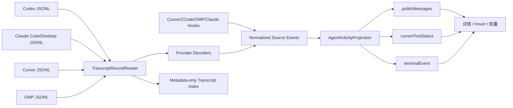

# ThreadHelm 大 Transcript 与统一最近消息管线最终实施计划

- **Date**: 2026-08-17
- **Status**: Implemented
- **Implemented**: 2026-08-18
- **Review**: APPROVED（独立需求审查与方案复审已通过）
- **Scope**: Codex、Claude Code、Claude Desktop、Cursor、ZCode、OMP
- **Target**: `macos/ThreadHelm/Sources/ThreadHelm/`
- **Primary outcome**: 无论底层来源是增长中的 JSONL transcript、SQLite 元数据还是 Hook 事件，ThreadHelm 都稳定展示最近公开消息，并按时间倒序排列；工具状态和终态不再挤占或替代正文。

> 本文保留原始实施依据；§13 记录最终实现边界、逐项验收证据和实际执行的验证命令。

---

## 1. 需求摘要

### 1.1 必须实现

1. 将“大文件读取”从 OMP 单点问题提升为 transcript 型来源的公共能力。
2. 覆盖 ThreadHelm 当前五个内建 Agent：Codex、Claude Code、Cursor、ZCode、OMP；Claude Desktop 作为 Claude transcript 来源纳入同一契约。内建列表见 `AgentModels.swift:20-32`。
3. Codex、Claude Code/Desktop、Cursor、OMP 共用按原始字节处理的增量 JSONL reader、文件身份校验、metadata-only checkpoint 和有界冷启动回扫。
4. ZCode 和其他 Hook 来源继续使用 Hook 事件，不套用文件 offset；但必须进入相同的公共活动投影。
5. 最近消息只展示经过隐私过滤的公开消息，按 `timestamp DESC, sourceOrder DESC` 稳定排序。
6. 将活动拆成三个互不抢占配额的通道：
   - `publicMessages`
   - `currentToolStatus`
   - `terminalEvent`
7. 工具-only 增量不得清空已恢复的正文；正文为空时不得退回完整工具事件列表。
8. 所有扫描、解析和索引 I/O 都在后台执行，有明确字节、时间、单行和内存预算。
9. ThreadHelm 不修改任何厂商 transcript；持久化索引不得保存正文、工具输入/结果或未完成 JSONL 行。
10. 详情页、悬浮预览和折叠胶囊使用同一投影语义，不再分别猜测 `events.first`、`events.last` 或 `suffix(3)` 的含义。

### 1.2 不在本期范围

1. 不建立全文消息数据库，不引入 SQLite 作为 ThreadHelm 的 transcript 副本。
2. 不实现跨会话全文搜索、任意历史分页或永久归档。
3. 不改变各 Agent 的跳转、恢复、权限或 capability 真值；只做不回归验证。
4. 不将模型上下文 compaction 当作读取层方案。Continue/OpenHands 的 compaction 解决模型上下文预算，不解决本机 transcript 定位。
5. 不把 Hook 原始 payload、thinking、tool input、tool result 或内部路径提升为公开消息。
6. 不新增第三方依赖。
7. 不修改厂商生成文件的内容、权限、位置或生命周期。

---

## 2. 仓库现状与问题证据

### 2.1 来源矩阵

| 来源 | 当前输入 | 当前读取行为 | 本计划处理方式 |
| :--- | :--- | :--- | :--- |
| Codex | `~/.codex/sessions/**/rollout-*.jsonl` | 固定读取尾部 1 MiB，见 `CodexTaskProgress.swift:49,783-800` | 共享 JSONL reader + Codex decoder；标题索引按目标 thread ID 有界反向查找 |
| Claude Code | `~/.claude/projects/**/*.jsonl` 等 | 固定读取尾部 1 MiB，见 `ClaudeTaskProgress.swift:311,851-873` | 共享 JSONL reader + Claude decoder |
| Claude Desktop | `~/Library/Application Support/Claude/local-agent-mode-sessions/**/.claude/projects/*.jsonl` | 与 Claude reader 共用候选扫描，入口见 `ClaudeTaskProgress.swift:781-802,943-990`；当前 checkout 映射为 `allowsAgentOpen=true` | 与 Claude Code 共用 reader/decoder；保持当前可打开契约，不借本项目扩大为新的 capability |
| Cursor | `agent-transcripts/**/*.jsonl` + Cursor SQLite 元数据 | JSONL 固定尾读 1 MiB，见 `CursorLocalWorkspace.swift:41-42,438-460`；标题仍查 SQLite | JSONL 走共享 reader；SQLite 继续只读元数据，不复制进索引 |
| ZCode | 受管 Hook envelope | 观察并 reduce Hook，见 `ZCodeAgentAdapter.swift:737-750` | 不使用 transcript offset；输出归一化后进入公共投影 |
| OMP | `~/.omp/agent/sessions/**/*_<session>.jsonl` | 文件头 64 KiB + 文件尾 1 MiB，见 `OMPLocalSession.swift:17-19,182-204` | 共享 JSONL reader + OMP decoder；保留独立的首条 session metadata 探测 |

### 2.2 已确认的失效模式

1. **固定尾部窗口会漏正文。** 当最后一条公开 assistant 消息距离 EOF 超过 1 MiB，尾部全部是 tool/thinking 记录时，Codex、Claude、Cursor 和 OMP 都可能恢复不到最近正文。
2. **OMP 的 prefix + tail 不是语义窗口。** 它只能碰巧读到 cwd 和尾部记录，不能保证读到最近公开消息。
3. **读取边界不一致。** Codex/Claude 丢弃首个不完整行后严格 UTF-8 解码；Cursor 有 lossy fallback；OMP 将两个任意字节区间拼接后 lossy decode。正确边界应统一为“完整 JSONL record 的原始 bytes”。
4. **工具事件会替代正文。** `AgentLiveEventStore.swift:454-488` 目前只对 Cursor/OMP 做本地内容分支；本地内容为空时会落回 Hook 列表，导致工具事件刷屏。
5. **文本去重不可靠。** `TaskProgressModels.swift:467-479` 使用 `kind + text` 去重，并在同时间按文本字典序排序，会吞掉不同时间或不同 offset 的合法重复消息。
6. **展示数组承担了过多语义。** `TaskProgressItem.events` 是单一数组（`TaskProgressModels.swift:59-104`），正文、工具和 lifecycle 共享截断与排序。
7. **不同 UI 对数组方向有不同假设。** 详情页会在 `DynamicIslandTaskView.swift:1046-1058` 内重新倒序，而悬浮预览仍取 `suffix(3)`（`:1310-1317`），折叠胶囊还使用 `events.last`（`DynamicIslandView.swift:661-669`）。
8. **公开文本没有完整预算。** `safePublicActivityParagraph` 在 `TaskProgressModels.swift:403-457` 做脱敏，但没有单条和总字节上限。

### 2.3 已有可复用边界

1. 任务刷新已经在 utility queue 执行，见 `AppDelegate.swift:1353-1374`；新 reader 必须保持这条后台边界。
2. `TaskProgressRefreshReaderStore` 会复用成功完成的 reader，见 `AppDelegate.swift:1553-1580`，适合承载跨刷新增量状态。
3. Hook transport 已有 64 KiB 单事件、256 条/1 MiB 队列上限，见 `AgentTransport.swift:10-16`，本期不扩大。
4. Hook drop 已采用 owner-only、临时文件和 rename，见 `AgentHookDrop.swift:29-63`；索引文件沿用同等级的本地权限和原子性要求。
5. 构建脚本自动编译 `Sources/ThreadHelm/*.swift`，见 `macos/ThreadHelm/scripts/build.sh:14-45`；新增 Swift 文件不需要维护工程清单。

---

## 3. 设计依据与方案选择

### 3.1 外部参考

- [lnav performance](https://docs.lnav.org/en/latest/performance.html)：行索引与有限缓存，而非每次全量重读。
- [Vector file source](https://vector.dev/docs/reference/configuration/sources/file/)：文件身份、checkpoint、增量读取和轮转处理。
- [Fluent Bit Tail](https://docs.fluentbit.io/manual/data-pipeline/inputs/tail.md)：持久化 offset、buffer 上限、超长行和 rotation/truncation 契约。
- [Loki HTTP API](https://grafana.com/docs/loki/latest/reference/loki-http-api/#query-logs-within-a-range-of-time)：limit、方向和分页边界。
- [OpenHands event grouping](https://github.com/OpenHands/OpenHands/blob/4a7d73691d2a7c9e8038b7d6c7d970153a4de220/src/components/conversation-events/chat/group-events.ts#L10-L102)：连续工具 action/observation 语义折叠，不让工具噪音淹没对话。
- [Open WebUI database schema](https://docs.openwebui.com/reference/database-schema/#chat-message-table)：需要全局历史查询时再规范化逐消息存储；不是本期默认方案。

这些项目只作为设计证据，不成为运行依赖。

### 3.2 备选方案

#### 方案 A：把固定尾部从 1 MiB 调大

- 优点：改动最小。
- 缺点：没有正确性上限；工具输出继续增长后仍会复发，并增加每 2 秒轮询的 I/O 和解析成本。
- 结论：否决。

#### 方案 B：分别修四个 transcript reader

- 优点：每个 provider 可独立落地。
- 缺点：重复实现 UTF-8 边界、offset、轮转、索引和预算；行为继续漂移，ZCode/Hook 的展示语义仍不统一。
- 结论：否决。

#### 方案 C：共享字节读取/索引层 + provider decoder + 公共活动投影

- 优点：文件正确性只实现一次；保留各 provider 的格式差异；Hook 来源不被迫文件化；UI 获得统一语义。
- 缺点：需要分阶段迁移现有 parser，并引入 metadata-only sidecar 生命周期。
- 结论：采用。

#### 方案 D：把所有消息导入 ThreadHelm SQLite

- 优点：分页、搜索和任意历史查询最强。
- 缺点：扩大隐私、迁移、删除、备份和一致性范围；当前产品只需要最近消息。
- 结论：本期否决；只有正式立项跨会话搜索时重新评估。

### 3.3 ADR

- **Decision**：采用方案 C。
- **Drivers**：大文件正确性、隐私最小化、五 Agent 展示一致性。
- **Why chosen**：它同时解决固定尾读和工具刷屏，又不复制正文、不修改厂商 transcript、不引入数据库。
- **Consequences**：新增一份 ThreadHelm 私有 metadata 索引；provider parser 需要逐一迁移；首次遇到无索引超大文件时允许渐进回填。
- **Follow-ups**：若未来增加全文搜索或历史翻页，另立 RFC 评估 SQLite；不得在本索引格式中偷偷加入正文。

---

## 4. 最终架构



### 4.1 共享字节读取层

新增 `TranscriptEventReader.swift`，集中定义并实现：

```swift
struct TranscriptSourceIdentity: Codable, Equatable {
    let device: UInt64
    let inode: UInt64
    let birthSeconds: Int64
    let birthNanoseconds: Int64
}

struct TranscriptRecordLocation: Codable, Equatable {
    let startOffset: UInt64
    let byteCount: UInt32
    let sourceOrder: UInt64
    let eventClass: TranscriptIndexedEventClass
    let occurredAt: Date?
}

struct TranscriptReadBudget: Equatable {
    let chunkBytes: Int
    let maximumBytesPerPass: Int
    let maximumAutomaticBackscanBytes: Int
    let maximumRecordBytes: Int
    let softWallTime: TimeInterval
}
```

低层 reader 只负责：

1. 在 raw `Data` 中识别 LF 边界。
2. 只把完整 record 交给 provider decoder。
3. 返回 record 的精确 byte range 和单调 `sourceOrder`。
4. 最后一行不完整时不推进磁盘 checkpoint。
5. 超长行进入 discard-until-newline 状态，增加诊断计数，不扩容到无上限。
6. 每个 chunk 后检查时间、字节和取消条件。
7. 读取前后执行 `lstat`；identity 改变，或 size 缩到本轮计划读取区间以内时，丢弃本轮结果并重建。文件只追加增长是安全情况：本轮固定读取开始时的 EOF，新增长部分留给下一次 forward pass。
8. 不在低层做 lossy UTF-8；provider 只对完整 record 使用严格 UTF-8/JSON 解码。

初始预算写死为可测试常量：

| 预算 | 初始值 | 说明 |
| :--- | ---: | :--- |
| chunk | 1 MiB | 控制临时 buffer |
| 单次刷新读取 | 8 MiB | 覆盖当前已观察到约 7.3 MiB 的 tool-only 尾部，同时保持轮询有界 |
| 单次自动冷回扫累计 | 64 MiB / session / app lifecycle | 超出后保存 continuation，停止自动消耗 I/O |
| 单条 JSONL | 4 MiB | 超出时跳过并计数，不无限扩容 |
| soft wall time | 50 ms / pass | 每个 chunk 后检查；不得为了满足字节额度突破时间片 |

预算不是“保证 50 ms 内读完 8 MiB”，而是两个独立停止条件，先到者生效。若本次 app lifecycle 累计回扫 64 MiB 后仍没有公开消息，UI 显示无安全正文，同时保留工具/终态通道；continuation offset 落入 metadata sidecar，下次 app lifecycle 从该位置继续，不允许当前进程后台无限遍历数 GB。

时间预算测试使用可注入的 monotonic clock，验证“到达时间片后在下一个 chunk 边界停止”，不把共享 CI 机器上的真实 50 ms wall time 当成易抖动的硬断言。真实 wall time 只作为性能观测证据。

#### 4.1.1 与现有同步 reader 的衔接

`CombinedTaskProgressReader.readCollection()` 保持同步签名，但每次调用只做一个有界 pass；它已经运行在 `AppDelegate.swift:1358-1360` 的 utility queue 上。成功完成后，`TaskProgressRefreshReaderStore` 复用 reader，使 checkpoint、partial bytes 和 backscan continuation 跨 2 秒刷新周期保留。任何视图渲染都只能读取已经产生的投影，不得在主线程触发扫描。

冷启动状态机固定为：

1. discovery 定位 source URL，并在开始读取时取得 identity 和 snapshot EOF。
2. sidecar 有效时，按分通道 byte ranges 回读原文件，恢复公共投影；随后从 `committedOffset` forward 增量读取。
3. sidecar 不存在或失效时，把 snapshot EOF 作为 forward fence，从该位置向前有界回扫；同时只做 provider 所需的 bounded metadata probe。
4. 最后一个未完成行不进入投影，磁盘 `committedOffset` 停在上一条完整 LF 之后；partial bytes 只留内存。
5. 回扫期间文件增长时，本轮仍只读取 snapshot EOF 以内的稳定范围；新增部分下一次从 forward fence 继续读取。
6. identity 改变或文件缩短穿过已读取范围时，丢弃本轮 batch、清空旧内存投影并重建。

### 4.2 Checkpoint 与 sidecar

新增 metadata-only `TranscriptIndexStore`，可与 reader 放在同一文件，避免创建无必要的层。存储位置固定为：

```text
~/Library/Application Support/ThreadHelm/Transcript Index/v1/<agentID>/<session-key-digest>.json
```

目录和文件契约：

- `Transcript Index` 与 `<agentID>` 目录权限 `0700`。
- 索引文件权限 `0600`。
- 文件名使用 `agentID + native session ID` 的确定性摘要，不直接使用未验证 session 字符串作为路径组件；实现可使用系统 CryptoKit，不增加第三方依赖。
- 临时文件写完后 `rename(2)` 原子替换，并重新校验权限。
- 根目录设置 `isExcludedFromBackup = true`。
- 单文件最大 512 KiB；超出、JSON 损坏或 schema 不支持时删除并重建。
- 仅 checkpoint 变化时写入；同一 session 最多每 5 秒一次，terminal 时主动 flush。

允许持久化：

- schema version；
- agent ID 与 session key digest；
- source identity、observed size、mtime；
- 最后一条完整记录之后的 `committedOffset`；
- 冷回扫 continuation offset；
- 分通道保存的相关 record descriptors：最多 32 条公开消息、每个尚未收敛工具的起止 ranges、一个 terminal range、一个 metadata range；所有通道合计最多 256 条，工具记录不得挤掉公开消息 descriptors；
- 纯计数诊断，例如 skipped oversized records。

禁止持久化：

- user/assistant 正文，即使已脱敏；
- tool name、tool input、tool result；
- thinking、内部路径、cwd；
- call ID 原文；
- partial bytes 或未完成 JSONL 行；
- 原始 Hook payload；
- transcript 的复制片段。

重启后，reader 先验证 source identity，再按 byte ranges 回读厂商原文件，重新经过 provider decoder 和隐私过滤。索引只负责定位，不能直接成为 UI 内容来源。

生命周期：

1. source 被直接确认删除时，同一刷新删除对应 sidecar。
2. 启动时清理 7 天未被任何已发现 session 引用的孤儿 sidecar。
3. truncate、atomic replace、inode/birthtime 变化时废弃旧 ranges，从当前文件重建。
4. rename 后若 session locator 找到相同 identity，可继续使用原 checkpoint。
5. 索引读写失败必须 fail open 到有界扫描，不得让任务从列表消失。

### 4.3 内存状态

每个活动 session 维护：

- `committedOffset` 与仅内存的 partial bytes；
- 最多 32 条公开消息；
- 单条公开消息最多 4 KiB UTF-8；
- 所有公开消息合计最多 64 KiB UTF-8；
- 一个最新工具状态，最多 512 bytes；
- 一个终态事件，最多 256 bytes；
- 最多 256 个 metadata descriptors；
- 当前 backscan 进度和诊断计数。

隐私过滤顺序固定为：完整 JSON record 解码 → 提取公开字段 → `safePublicActivityParagraph` 脱敏 → UTF-8 安全截断。不得先截断秘密再尝试脱敏。

### 4.4 公共活动模型

在 `ActivityDashboardModels.swift` 增加：

```swift
struct AgentActivityEventID: Hashable, Equatable {
    let source: AgentID
    let sessionKey: String
    let stableSourceKey: String
}

struct AgentActivityEntry: Equatable {
    let id: AgentActivityEventID
    let occurredAt: Date
    let sourceOrder: UInt64
    let text: String
}

struct AgentActivityProjection: Equatable {
    let publicMessages: [AgentActivityEntry]
    let currentToolStatus: AgentActivityEntry?
    let terminalEvent: AgentActivityEntry?
}
```

最终不再以 `TaskProgressItem.events` 作为语义源。迁移期间可保留只读兼容投影，但必须满足：

- `events` 只能由 `AgentActivityProjection.displayEvents` 计算生成；
- provider 不能再直接写一个混合数组；
- 所有 provider 迁移后删除旧的桥接初始化器；
- 详情页的“最近消息”只消费 `publicMessages`；
- 当前工具状态和终态在各自的 UI 位置展示。

临时 bridge 从旧 `TaskActivityEvent` 转换时，使用 `provider + session + 本次输入 insertion index` 生成仅进程内有效的 legacy ID，并把 index 写入 `sourceOrder`。它不能落 sidecar，也不能用于跨刷新去重；provider 迁移后必须删除。这样迁移期间也不会因为文本相同而吞消息。

稳定身份与顺序：

- transcript：`agentID + source identity + byte range`；
- Hook：`agentID + session key + eventID`，同 ID 只保留最高有效 sequence/revision；
- 主排序：`occurredAt DESC`；
- 同时间 transcript：`sourceOrder/byte offset DESC`；
- 同时间 Hook：`sequence DESC`，缺失 sequence 时用首次观测的稳定 insertion order；
- 禁止使用文本字典序作为 tie-breaker；
- 相同文本但不同稳定 ID 的消息必须同时保留。

### 4.5 来源合并规则

1. transcript 公开消息只能进入 `publicMessages`。
2. Hook 的工具状态只能进入 `currentToolStatus`，除非厂商 Hook 明确提供经过 allowlist 的公开 assistant message。
3. terminal event 进入 `terminalEvent`，并清除陈旧的 `currentToolStatus`。
4. tool-only 更新只替换工具状态，不能清空 `publicMessages`。
5. transcript 暂时不可用时保留同一 source identity 的内存正文；identity 改变或 source 删除后必须清除。
6. Hook 与 transcript 同时报告终态时，以更高证据质量和更新 source order/revision 决定，不能产生两条重复终态。
7. ZCode 没有 transcript 时，`publicMessages` 可以为空；不得用工具列表伪造“最近消息”。

---

## 5. Provider 迁移设计

### 5.1 OMP

涉及文件：

- `OMPLocalSession.swift`
- `OMPAgentAdapter.swift`
- `AgentLiveEventStore.swift`
- `OMPAgentAdapterSelfTest.swift`
- `AgentLiveEventStoreSelfTest.swift`

步骤：

1. 用共享 reader 替换 `boundedTranscriptData` 和 prefix/tail 拼接。
2. session metadata/cwd 继续通过第一条完整 `session` record 的有界前缀探测恢复；正文不依赖前缀。
3. OMP decoder 只接受公开 assistant message、工具 lifecycle 和 terminal state 的 allowlist 字段。
4. `agent_end + willContinue` 契约保持不变；不得恢复已废弃的 Pi `agent_settled`。
5. 删除 `maximumPrefixBytes`、`maximumTailBytes` 和 lossy 拼接逻辑。

### 5.2 Cursor

涉及文件：

- `CursorLocalWorkspace.swift`
- `CursorAgentAdapter.swift`
- `CursorAgentAdapterSelfTest.swift`
- `AgentLiveEventStoreSelfTest.swift`

步骤：

1. 用共享 reader 替换 `tailedUTF8String`。
2. 保留 Cursor SQLite 的参数化只读查询用于 title/composer metadata，见 `CursorLocalWorkspace.swift:143-209`；不得把查询结果持久化进 transcript sidecar。
3. 删除 fragment 的 `kind + text` 去重，改用 transcript range 或 Hook event ID。
4. Cursor 本地正文为空时只显示独立工具状态，不再把全部 Hook 事件作为正文。
5. 保持 Cursor 版本校验、沙箱 Hook drop 和导航真值不变。

### 5.3 Codex

涉及文件：

- `CodexTaskProgress.swift`
- `TaskProgressSelfTest.swift`
- `TaskProgressSelfTestPhase2.swift`

步骤：

1. 将 `parse(lines:)` 拆为可增量消费完整 record 的 reducer，状态包含 lifecycle、pending input、active tool、最新公开 commentary、cwd 和 terminal。
2. 用共享 reader 替换 `readTailLines`；新记录只增量 reduce，tool-only 尾部不得清掉先前正文。
3. 冷启动通过 sidecar ranges 回读相关 records；无索引时有界倒扫。
4. `session_meta` 使用首条完整 record 的 bounded metadata probe，不要求扫描整文件。
5. `session_index.jsonl` 不再在每次 mtime 变化时无条件 `Data(contentsOf:)` 全量解析；先取得当前最多 12 个候选 thread IDs，再从 index 尾部有界倒查直到全部命中或预算耗尽。标题缓存只留内存，不落 sidecar。
6. 保持 unread、automation、subagent、visibility 和 native thread navigation 契约不变。

### 5.4 Claude Code 与 Claude Desktop

涉及文件：

- `ClaudeTaskProgress.swift`
- `TaskProgressSelfTest.swift`
- `TaskProgressSelfTestPhase2.swift`

步骤：

1. 将 Claude parser 改为可增量 reducer，用共享 reader 替换 `readTailLines`。
2. CLI 与 Desktop transcript 使用同一 decoder 和预算，但 source root、freshness 与 `allowsAgentOpen` 继续由现有候选元数据决定。
3. 当前 checkout 将 Desktop transcript 映射为 `allowsAgentOpen=true`，且自测要求 `canOpen=true`（`TaskProgressSelfTest.swift:421-435`）；迁移必须保持这一现状。共享 reader 本身不得宣称新的 resume/exact return 能力，也不得修改既有打开路径。
4. 进程探测、30 秒活动推断、permission/question/plan approval 通道保持原契约。
5. 覆盖两个 root 下同 session ID、文件替换、Desktop 文件仅短暂更新等场景。

### 5.5 ZCode 与 Hook-only 来源

涉及文件：

- `ZCodeAgentAdapter.swift`
- `AgentEventReducer.swift`
- `AgentLiveEventStore.swift`
- `AgentLiveEventStoreSelfTest.swift`

步骤：

1. 不新增 ZCode transcript reader。
2. 将 Hook envelope 映射到公共三通道投影。
3. 使用现有 `eventID/sequence/revision` 去重和排序，不退化为文本去重。
4. 只保留一个当前工具状态；PostToolUse/terminal 到达后收敛或清除。
5. 没有公开消息时 UI 明确显示“暂无可安全展示的最近消息”，而不是展示所有工具调用。

---

## 6. UI 行为合同

涉及文件：

- `DynamicIslandTaskView.swift`
- `DynamicIslandView.swift`
- `DynamicIslandSelfTest.swift`
- `DynamicIslandPreviewRendering.swift`

### 6.1 详情页

1. “最近消息”表格只显示 `publicMessages`。
2. 第一行永远是最新公开消息；相同时间按稳定 source order 倒序。
3. 当前工具状态作为单独、可更新的一行，不进入消息滚动区。
4. terminal event 进入任务状态区域；完成/失败后不保留绿色呼吸点或陈旧工具状态。
5. 暂无消息但正在执行工具时，同时显示：
   - 最近消息：`暂无可安全展示的最近消息`
   - 当前状态：单条工具状态
6. 不再在 `renderEvents` 内猜测输入数组方向；投影在进入视图前已经规范化。

### 6.2 Hover 预览

1. 展示最新 3 条公开消息。
2. 顺序与详情页完全一致，最新在最上。
3. 工具状态不占 3 条消息配额；可以在独立状态行展示。

### 6.3 折叠胶囊

活动文案优先级固定为：

1. waiting/permission/question 等需要用户处理的状态；
2. active 时的 `currentToolStatus`；
3. 最新 `publicMessages.first`；
4. terminal event；
5. provider 的安全默认文案。

不得再用混合数组的 `last` 推断“最新事件”。

---

## 7. 实施步骤

### Phase 0：先锁定现有行为与失败样本

**只改测试，先证明失败。**

1. 在临时目录动态生成大 JSONL，不提交 20/100 MiB fixture。
2. 为 Codex、Claude、Cursor、OMP 各生成一种 provider 格式：最近公开消息距 EOF 至少 7 MiB，尾部只有工具/结果记录。
3. 增加相同文本、相同 timestamp、跨 chunk UTF-8、未完成尾行、超长单行、truncate、replace、rename 用例。
4. 增加 ZCode/Hook-only “工具状态不进入最近消息”用例。
5. 增加详情/hover 顺序一致性用例。

**红灯证据**：现有固定窗口至少在四个 transcript 来源的大尾部样本上恢复不到公开消息，或落回工具列表。

### Phase 1：引入公共活动投影，不改变读取方式

1. 在 `ActivityDashboardModels.swift` 增加稳定 ID 和三通道模型。
2. 在 `TaskProgressModels.swift` 增加统一预算/脱敏后截断 helper。
3. 给旧 provider 输出增加临时 bridge，但 `TaskProgressItem.events` 改为只读派生结果。
4. 先改 UI 消费公共投影，锁定倒序、hover 和胶囊优先级。
5. 新旧 reader 输出对比测试必须一致，除已明确修正的工具混入和排序行为。

### Phase 2：实现共享 JSONL reader 与 metadata-only index

1. 新增 `TranscriptEventReader.swift`，实现 forward incremental、backward bounded scan、完整行边界、identity 和预算。
2. 同文件实现 owner-only index store，或仅在代码超过单一职责阈值后拆为 `TranscriptIndexStore.swift`；禁止预先制造额外抽象。
3. 新增 `TranscriptEventSelfTest.swift` 和 `--self-test-transcript-events` 独立入口，同时从 `--self-test-task-progress` 调用核心契约。
4. 验证 index hit、cold scan、incremental tail 三条路径产生相同 record 序列。
5. 验证 sidecar 原始 bytes 不含测试 sentinel 正文/工具参数/路径。

### Phase 3：迁移 OMP 与 Cursor

1. 先迁移 OMP，使用真实问题形状验证公共 reader。
2. 再迁移 Cursor，保留 SQLite metadata 边界。
3. 修改 `AgentLiveEventStore`，取消“本地正文为空 → 全量 Hook 列表”的 fallback。
4. 删除两处旧 tail/prefix reader 和文本去重逻辑。
5. 运行 provider self-tests、live store self-test 和 UI self-test。

### Phase 4：迁移 Codex、Claude Code 与 Claude Desktop

1. 将 Codex/Claude parser 改为增量 reducer。
2. 接入共享 reader 和 checkpoint ranges。
3. Codex 标题索引改为按当前候选 ID 有界倒查。
4. 验证 CLI/Desktop Claude 的 source root、当前 `allowsAgentOpen/canOpen` 行为和 freshness 不回归。
5. 删除两个 `readTailLines` 和固定 `maximumTailBytes`。

### Phase 5：统一 Hook/ZCode 投影并完成清理

1. 将 ZCode 和其他 Hook 事件映射到三通道投影。
2. 删除 `kind + text` 去重和文本字典序 tie-breaker。
3. 删除迁移 bridge、provider-specific 混合数组写入和废弃 helper。
4. 更新 `docs/threadhelm-local-operations.md`：索引目录、权限、清理方法、故障降级、明确“不保存正文”。
5. 若用户可见隐私声明涉及新本地索引，同步更新 `PRIVACY.md`。

### Phase 6：全量验证与真实大文件验收

1. 执行下方 §9 的自动验证矩阵。
2. 用只读方式验证至少一个真实 Codex/Claude/Cursor/OMP 大 transcript；不得改写源文件。
3. 检查 index 文件权限、大小、备份排除和内容边界。
4. 用 Instruments 或 signpost/计数诊断确认 UI 主线程没有 transcript I/O。
5. 只有全部验收项通过后，才能把计划状态改为 Implemented；未完成的真实来源必须明确标记 `Not-tested`，不能用 fixture 结果替代。

---

## 8. 文件级变更清单

### 新增

| 文件 | 责任 |
| :--- | :--- |
| `macos/ThreadHelm/Sources/ThreadHelm/TranscriptEventReader.swift` | 字节边界、增量/反向读取、文件身份、预算、checkpoint、metadata-only index |
| `macos/ThreadHelm/Sources/ThreadHelm/TranscriptEventSelfTest.swift` | 大文件、UTF-8、partial、rotation、隐私、预算、损坏恢复 |

### 修改

| 文件 | 变更 |
| :--- | :--- |
| `ActivityDashboardModels.swift` | 稳定事件 ID 与 `AgentActivityProjection` |
| `TaskProgressModels.swift` | `TaskProgressItem` 使用公共投影；安全文本三层预算；删除文本去重 |
| `CodexTaskProgress.swift` | 增量 reducer、共享 reader、标题索引有界倒查 |
| `ClaudeTaskProgress.swift` | CLI/Desktop 共用增量 reducer 与 reader |
| `CursorLocalWorkspace.swift` | 删除固定尾读；保留 SQLite metadata；稳定身份 |
| `OMPLocalSession.swift` | 删除 prefix/tail 拼接，改用共享 reader |
| `AgentLiveEventStore.swift` | channel-aware merge，删除工具列表 fallback |
| `AgentEventReducer.swift` | Hook stable ID/sequence 与公共投影 |
| `ZCodeAgentAdapter.swift` | Hook-only 三通道映射，不新增 transcript |
| `DynamicIslandTaskView.swift` | 最近消息、工具状态、hover 使用明确通道 |
| `DynamicIslandView.swift` | 胶囊文案使用明确优先级 |
| `main.swift` | 新增 `--self-test-transcript-events` |
| `TaskProgressSelfTest*.swift` | 四种 transcript provider 和公共投影回归 |
| `AgentLiveEventStoreSelfTest.swift` | transcript + Hook 合并、ZCode、tool-only 不清正文 |
| `DynamicIslandSelfTest.swift` | 详情/hover/胶囊排序和通道展示 |
| `docs/threadhelm-local-operations.md` | 索引运维、权限、清理和降级说明 |
| `PRIVACY.md` | 若现有声明未覆盖 metadata-only index，则补充说明 |

### 迁移完成后必须删除

- `CodexTaskProgressReader.readTailLines`
- `ClaudeTaskProgressReader.readTailLines`
- `CursorLocalWorkspace.tailedUTF8String`
- `OMPLocalSession.boundedTranscriptData`
- 四处固定 `maximumTailBytes` / `maximumPrefixBytes`
- `kind + text` 去重
- 同时间按文本字典序排序
- `AgentLiveEventStore` 的 Cursor/OMP 特殊混合数组 fallback
- UI 中基于混合数组 `first/last/suffix` 推断语义的代码

---

## 9. 验收标准与验证命令

### 9.1 功能验收

- [x] **AC-01**：Codex、Claude Code、Claude Desktop、Cursor、OMP 的最近公开消息均来自统一 transcript reader；ZCode 明确走 Hook-only 路径。
- [x] **AC-02**：20 MiB transcript 中，最近公开消息距 EOF 至少 7 MiB；在有界自动回扫 continuation 内恢复该消息。测试使用可控 monotonic clock，避免 soft time budget 抢先终止造成歧义。
- [x] **AC-03**：100 MiB tool-only 尾部不会触发单轮无界读取；每 pass 不超过 8 MiB，并在注入时钟越过 50 ms 后的第一个 chunk 边界停止。
- [x] **AC-04**：tool-only 增量不会清空先前 `publicMessages`，也不会把工具列表填进最近消息。
- [x] **AC-05**：详情页和 hover 均按时间倒序；同 timestamp 按 byte offset/sequence 稳定倒序。
- [x] **AC-06**：两条相同文本、不同 byte range/eventID 的消息均保留。
- [x] **AC-07**：JSONL 行跨 chunk、UTF-8 多字节字符跨 chunk、最后一行未完成都不损坏记录；checkpoint 只推进到完整行后。
- [x] **AC-08**：append、truncate、atomic replace、rename 和源文件删除均按 §4.2 契约处理。
- [x] **AC-09**：超过 4 MiB 的单行被有界跳过并增加诊断计数，内存不随该行继续增长。
- [x] **AC-10**：index hit、cold backscan、incremental tail 三条路径生成等价公共投影。
- [x] **AC-11**：sidecar 不包含测试 sentinel 正文、tool input/result、partial bytes、cwd 或原始 Hook payload。
- [x] **AC-12**：sidecar 目录/文件权限分别为 `0700/0600`，根目录排除备份，单文件不超过 512 KiB。
- [x] **AC-13**：损坏、超版本或错误权限的 sidecar 被安全丢弃并重建，不影响源 transcript。
- [x] **AC-14**：所有 transcript 和 sidecar I/O 都发生在非主线程；扫描可在 chunk 边界取消，取消延迟不超过一个 chunk。
- [x] **AC-15**：每 session 内存正文最多 32 条、单条 4 KiB、合计 64 KiB；工具/终态有独立预算。
- [x] **AC-16**：完成/失败后 current tool 状态清除；详情页不遗留活动绿点或陈旧“正在执行”。
- [x] **AC-17**：Claude Desktop 保持当前 `allowsAgentOpen=true` 且 `canOpen=true` 的测试契约；Codex/Claude/Cursor/ZCode/OMP 的既有 open capability 均不扩大、不降级。
- [x] **AC-18**：Cursor SQLite 仍是只读元数据来源，ThreadHelm sidecar 不复制 SQLite 字段。
- [x] **AC-19**：真实厂商 transcript 在测试前后 size、mtime 和 SHA-256 不变。
- [x] **AC-20**：现有 81 场景真值回放、task progress、live event、dynamic island 和隐私审计全部通过。

### 9.2 自动验证

```bash
./macos/ThreadHelm/scripts/build.sh

BIN="macos/ThreadHelm/build/ThreadHelm.app/Contents/MacOS/ThreadHelm"
"$BIN" --self-test-transcript-events
"$BIN" --self-test-task-progress
"$BIN" --self-test-dynamic-island
"$BIN" --self-test-lifecycle
"$BIN" --self-test-client-contract

zsh scripts/tests/test-agent-truth-replay.sh
python3 scripts/tests/test-agent-truth-fixtures.py
./scripts/privacy-audit.sh
```

若实现修改 truth fixture schema，必须同时验证 fixture integrity 的拒绝路径；不能只跑 production replay 的 happy path。

### 9.3 性能与 I/O 证据

`--self-test-transcript-events` 必须输出不含路径/正文的计数摘要，例如：

```text
transcript-events-self-test: providers=5 transcript=4 hook-only=1 \
  large-tail=pass utf8-boundary=pass partial=pass rotation=pass \
  index=metadata-only budgets=8MiB/64MiB/4MiB memory=32/64KiB
```

另记录以下测量但不写入用户内容：

- bytes read per pass；
- records decoded/skipped；
- index hit/miss/corrupt reset；
- backscan continuation count；
- wall time；
- main-thread I/O violation count（必须为 0）。

### 9.4 手工验收

1. 选择四种真实 transcript，分别覆盖 Codex、Claude、Cursor、OMP；记录源文件 size、mtime、SHA-256，只做只读 smoke test。
2. 启动 ThreadHelm，确认真实来源的详情页最近消息和当前工具状态分离。
3. 退出后再次核对真实源文件 size、mtime、SHA-256 不变。
4. 另行复制或生成四种隔离测试副本；后续 append/truncate/replace 测试只操作副本，不操作真实厂商文件。
5. 向副本追加大量 tool-only 记录，确认正文不消失、列表不刷屏。
6. 关闭并重启测试实例，确认 metadata sidecar 命中后恢复相同投影。
7. 检查 sidecar 权限、内容和备份排除标记；删除测试副本后验证 sidecar 清理。

---

## 10. 风险与缓解

| 风险 | 影响 | 缓解 |
| :--- | :--- | :--- |
| 把公共 reader 做成 OMP helper | 其他三种 transcript 继续复发 | 公共 reader 无 provider 名称；四种 decoder 合同测试 |
| 增量 reducer 与现有全量 parse 行为漂移 | lifecycle/等待输入判断回归 | 迁移期对同一 fixture 运行旧/新 parser differential test |
| sidecar 意外保存敏感文本 | 新增隐私数据副本 | schema allowlist + raw bytes sentinel 测试 + 512 KiB 上限 + privacy audit |
| 文件在读取中 replace/truncate | 混合两个文件的记录 | read 前后 identity/size 校验，不一致时丢弃本轮 batch |
| 超长无换行记录导致内存膨胀 | 卡顿或 OOM | 4 MiB record cap + discard-until-newline |
| 冷启动扫描数 GB | 电量/I/O 异常 | 8 MiB/pass、50 ms soft slice、64 MiB automatic cap、可取消 continuation |
| 文本相同被错误去重 | 合法消息丢失 | byte range/eventID 稳定身份 |
| Hook 与 transcript 双报终态 | 重复或顺序跳动 | channel-aware merge + evidence/revision/source order |
| UI 仍用混合数组方向 | 详情与 hover 顺序不一致 | 视图只消费规范化 projection；删除旧 `suffix/last` 推断 |
| Cursor SQLite 被扩大成正文存储 | 隐私和锁争用扩大 | 明确只读 metadata；sidecar schema 禁止 SQLite 字段 |
| 索引写放大 | 每 2 秒大量磁盘写 | 仅 checkpoint 变化写，5 秒/session coalesce，terminal flush |
| 工作区已有 WIP 被覆盖 | 丢失未提交工作 | 实施时精确暂存本计划涉及路径；禁止 reset/stash/clean/`commit -a` |

---

## 11. 建议提交切片

实现时按以下逻辑提交，所有提交遵守仓库 Lore Commit Protocol；不得把无关 WIP 混入：

1. **锁定跨 Agent 大 transcript 失败合同**：只包含回归测试和临时大文件生成器。
2. **建立统一活动投影语义**：模型、排序、UI 消费和兼容 bridge。
3. **让 transcript 读取拥有有界字节与 metadata checkpoint**：共享 reader/index 及自测。
4. **让 OMP 与 Cursor 不再因工具尾部丢正文**：两种 provider 迁移和 live merge。
5. **让 Codex 与 Claude 在长会话中保持最近正文**：增量 reducer、CLI/Desktop 覆盖。
6. **统一 Hook-only 展示并删除旧路径**：ZCode、清理 bridge、删除固定尾读/文本去重。
7. **固化本地索引运维和隐私合同**：operations/privacy 文档及最终验证证据。

每个提交的 `Tested:` 必须写实际执行的命令；未做真实大文件或真实 provider 验收时必须写 `Not-tested:`，不能把计划中的命令当作已执行。

---

## 12. 完成定义

只有同时满足以下条件，才能把本文状态从 `Final Plan / Ready for Implementation` 改为 `Implemented`：

1. §9.1 的 20 条验收全部有证据。
2. 四种 transcript provider 和 ZCode/Hook-only 都有独立测试，不以 OMP 结果代表全部来源。
3. 旧固定尾读、文本去重和混合数组 fallback 已删除，不是仅绕过。
4. 源 transcript 只读证据、sidecar metadata-only 证据和 UI 主线程零 I/O 证据齐全。
5. 构建、自测、81 场景 replay、fixture integrity 和 privacy audit 全绿。
6. 实际改动文件、简化项、剩余风险和 `Not-tested` 边界已在最终交付报告中明确列出。

---

## 13. 最终实现与验收记录

### 13.1 实现结论

1. Codex、Claude Code/Desktop、Cursor 和 OMP 已迁移到共享 `TranscriptEventReader`；ZCode 保持 Hook-only，并进入相同的三通道活动投影。
2. 固定 tail/prefix 拼接、正文按文本去重、工具事件回填正文和 UI 对混合数组方向的推断均已删除；最近公开消息统一按 `occurredAt DESC, sourceOrder DESC` 展示。
3. transcript 事件的 `sourceOrder` 使用绝对 byte offset；index hit、冷回扫 continuation、增量 append 和进程重启保持稳定排序。
4. metadata-only sidecar 使用 source identity 与 byte ranges，目录/文件权限为 `0700/0600`，根目录排除备份，单文件上限 512 KiB；不保存正文、cwd、工具内容、SQLite 字段或 Hook payload。
5. 四种 provider 均覆盖 append、truncate、atomic replace、rename/delete 和同大小同 mtime replace；每次刷新、生命周期回扫、单条记录和内存展示均受预算约束。
6. 新增本机专用 `--self-test-real-transcript-readonly`，通过 production collection/read path 验证 Codex、Claude、Cursor、OMP，并隔离与 transcript 合同无关的 Codex 已读状态；真实源文件只做读取和指纹比对。

### 13.2 AC 证据映射

| 验收项 | 完成证据 |
| :--- | :--- |
| AC-01～AC-03 | `--self-test-transcript-events` 报告 `providers=5 transcript=4 hook-only=1`；`--self-test-large-window-regression` 报告 `ac02=20MiB-continuation ac03=100MiB-soft-stop`。 |
| AC-04～AC-06 | task progress、live event 与 Dynamic Island 自测覆盖三通道、重复正文保留、详情/hover `newest-first+stable-ties`；transcript 自测报告 `stable-order=byte-offset`。 |
| AC-07～AC-10 | transcript 自测覆盖跨 chunk UTF-8/partial/超长行、append/truncate/replace/delete，以及 `restart=index-hit+cold-scan+incremental-tail`；provider 自测覆盖同大小原子替换。 |
| AC-11～AC-13 | index 自测验证 metadata-only sentinel、512 KiB、`0700/0600`、备份排除、损坏/超版本/错误权限丢弃重建。 |
| AC-14～AC-16 | transcript 自测报告 `main-thread-io=0`；large-window 自测报告 `ac14=chunk-cancel`；预算输出为 `8MiB/64MiB/4MiB memory=32/64KiB`；终态与 Dynamic Island 自测验证工具状态和活动指示清除。 |
| AC-17～AC-18 | task progress、client contract、81 场景 truth replay/fixtures 通过，Claude Desktop 为 `local-session+navigation`；Cursor SQLite 保持只读 metadata，sidecar schema/隐私测试拒绝 SQLite 字段。 |
| AC-19 | `--self-test-real-transcript-readonly` 报告 `providers=4 unchanged=4 metadata=size,mtime,sha256`。 |
| AC-20 | 完整 App 自测、81 场景 fixtures、production replay、privacy audit、release verify-only、repository layout 和 `git diff --check` 全部通过。 |

### 13.3 实际验证命令与结果

```bash
./macos/ThreadHelm/scripts/build.sh

BIN="macos/ThreadHelm/build/ThreadHelm.app/Contents/MacOS/ThreadHelm"
"$BIN" --self-test-transcript-events
"$BIN" --self-test-large-window-regression
"$BIN" --self-test-task-progress
"$BIN" --self-test-dynamic-island
"$BIN" --self-test-client-contract
"$BIN" --self-test-lifecycle
"$BIN" --self-test-native-notification-state
"$BIN" --self-test-agent-integration-manager
"$BIN" --self-test-weekly-quota
"$BIN" --self-test-claude-quota
"$BIN" --self-test-claude-hook
"$BIN" --self-test-threadhelm-edition
"$BIN" --self-test-real-transcript-readonly

zsh scripts/tests/test-agent-truth-replay.sh
python3 scripts/tests/test-agent-truth-fixtures.py
./scripts/privacy-audit.sh
zsh scripts/tests/test-build-macos-release-verify-only.sh
python3 scripts/validate-repository-layout.py
git diff --check
```

2026-08-18 最终运行结果均为 exit 0。truth fixtures 为 `agents=5 scenarios=81 previews=18`；真实 transcript 为四种 provider 全部指纹不变。

### 13.4 简化项与剩余边界

- 删除了四个 provider 各自维护固定尾部窗口的方向，统一为一个有界字节 reader 和 metadata checkpoint；没有新增第三方依赖或全文消息数据库。
- UI 只消费 `AgentActivityProjection`，正文、当前工具和终态不再争用同一配额。
- Dynamic Island 自测仍会输出一次既有 AppKit constraint warning，但测试 exit 0，所有布局/排序断言通过；这是当前唯一已知的非阻塞诊断噪音。
- `Not-tested`：本次没有执行发行包 notarization 或长时间人工 soak；它们不属于本计划的本地源码验收矩阵。真实 transcript 不变、生产读取路径、UI 投影、主线程 I/O 计数和取消边界均由确定性自测覆盖。
- 本轮未 commit、未 push；现有工作区 WIP 完整保留。
